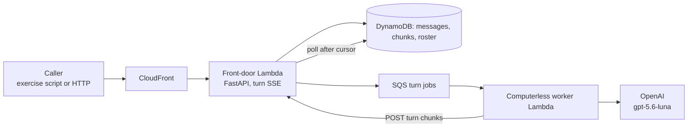
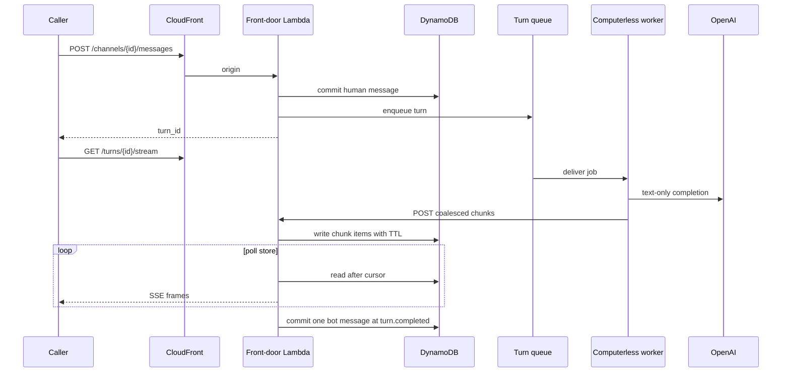
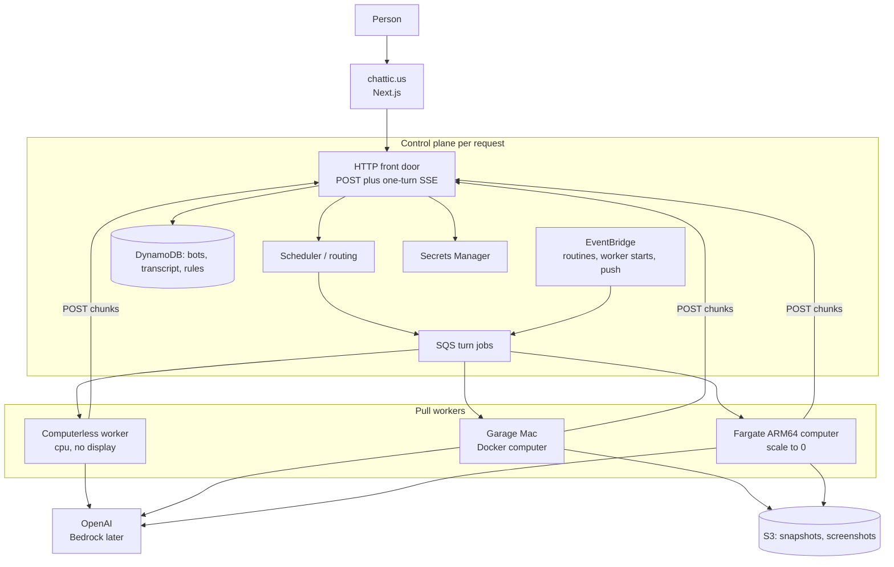

# Chatticus

Chatticus is a roster of named AI teammates that do real work on a computer
you control. You message a teammate. It uses tools, files, a browser, and a
shell. It comes back when something needs your approval.

The product lives at [chattic.us](https://chattic.us).

v1 is personal: one household, one AWS account, as many named bots as we
want. The worker protocol is tenant-aware from day one so the same system
can later serve other people without a rewrite.

## What Chatticus is

A **bot** is a persistent, named teammate. It keeps memory, preferences, and
conversation. It is not a fresh chat session on every task.

A **computer** is a Linux workplace with a browser, a filesystem, and a
terminal. It belongs to a **user**, not to a bot. Every bot on that user
shares `/workspace`, browser sessions, and command-line credentials so they
can hand work off. Each bot gets its own screen so they can work in parallel.
Separate bots are not a security boundary.

Work prefers **structured tools** (APIs, MCP servers, connectors) when they
exist. The computer's browser is the fallback for sites and apps that have no
clean API.

A **skill** is how to do a task. A **routine** is when to run it (a schedule
or an event). **Approvals** stop consequential actions: sending, purchasing,
publishing, deleting, and production changes.

Closing your laptop does not stop work. The computer runs on a worker, not
on the device in front of you.

## Architecture now and later

The control plane is serverless and holds **no persistent sockets**. The
browser POSTs a message and reads **one turn** as server-sent events. Workers
**pull** jobs and POST coalesced chunks. Nothing in the token path is an
always-on process.

Two pictures matter, and they are not the same: what is deployed today, and
the v1 architecture that deployment is a slice of.

### Current state: a computerless thin turn

Live in AWS account `335163751677` (`us-east-1`), stack **ChatticusThinTurn**:

- CloudFront in front of a Lambda function URL (no load balancer).
- FastAPI front door: channels, messages, bots, a stopped-computer roster,
  chunk POST, and `GET /turns/{id}/stream` as `text/event-stream`.
- DynamoDB is the source of truth for the transcript, in-flight chunks
  (TTL), and the thin roster. SSE **polls the store**, so the worker Lambda
  and the streaming function are not the same process.
- SQS carries one turn job. A **computerless** worker Lambda runs
  **gpt-5.6-luna** (OpenAI) and POSTs chunks back through the front door.
- Auth on this slice is an invoke key plus `X-Tenant-Id`, not product login.

**ChatticusSnapshots** and **ChatticusComputers** exist and must not be
destroyed. They are not on the turn path yet. The computer stays stopped.
There is no chattic.us web app, no local pull worker, no mid-turn
escalation, and no approvals on this slice.





The same turn on a reconnect is a new SSE request that reads committed
chunks after `Last-Event-Id`. In-process queues are not the architecture.

### Goal: v1 product architecture

v1 still scales to zero. What changes is that a turn may stay computerless,
or **summon** the user's one Linux computer when a tool needs a display,
browser, or `/workspace`. The control plane never SSHs into a garage. Workers
register, heartbeat, and pull.



How a turn chooses a host:

1. A message or routine creates a turn job with `tenant_id`, required
   capabilities (`cpu`, and maybe `computer` / `browser` / `terminal`), and
   an optional `computer_id` pin.
2. Healthy workers pull. Prefer an already-warm cheap host (local Docker
   when the Mac is on), then a warm AWS computer, then a cold Fargate start.
3. The model loop runs **on the worker**, as soon as it has network and
   memory. Display, Chromium, and snapshot hydrate gate only the actions
   that need them.
4. Reaching for a computer tool escalates the same turn: the computerless
   attempt appends the pending tool call and a computer-capable worker
   continues. No second transcript. No `stop_computer`; the workplace is
   shared by all of a user's bots.
5. At `turn.completed` the control plane commits **one** message row.

Lambda is the right runtime for the front door, auth callbacks, webhooks,
routine wake-ups, a computerless model loop, and holding one turn's SSE
stream. It is the wrong runtime for a workplace: it cannot hold a browser,
a display, or a session-lifetime connection. The computer is one Docker
image on Fargate, later stop/start EC2, or Docker on a Mac.

See [Architecture](docs/ARCHITECTURE.md) for routing, [Messaging](docs/MESSAGING.md)
for the transcript and stream, and [Design challenges](docs/DESIGN_CHALLENGES.md)
for what was rejected and why.

## Persistence

Compute and disk are separate. The **computer** is a `computer_id`. The
**host** is whichever Mac, Fargate task, or EC2 instance is running it.

Canonical workplace disk (`/workspace` and the browser profile) is an **S3
snapshot**. Hosts hydrate a local cache, run, and publish. Relocate is an
administrator action: point the next host at that snapshot. There is no live
container move. See [Computer snapshots](docs/COMPUTER_SNAPSHOTS.md).

| State | Where it lives |
| --- | --- |
| Bot memory, skills, routines | DynamoDB |
| Transcript (append-only messages) | DynamoDB |
| In-flight turn chunks | DynamoDB, with a TTL; they expire after the turn commits |
| `/workspace` and browser profile | S3 snapshot; local volume / EBS / EFS as a host cache |
| Secrets | AWS Secrets Manager, never in the image |

Computer policy: `prefer_local`, `aws_only`, or `local_only`. Idle AWS
computers stop (EC2) or scale to 0 (Fargate). The snapshot stays.

## Repository

```
Chattic.us/
  features/                 Shared Gherkin (product narrative)
  python/                   Control plane, computerless worker, snapshot packer
  web/                      chattic.us web app (not on the live turn path yet)
  computer/                 Linux computer image
  infra/                    AWS CDK
  docs/                     Product, architecture, design challenges, stack
```

v1 language for the product brain is **Python**. The web app is
**TypeScript**. Gherkin in `features/` is the behavior spec.

## What you can run today

Local quality gates (CI uses a fake OpenAI client; a live key is not
required):

```bash
cd python
python3 -m venv .venv
source .venv/bin/activate
pip install -e ".[dev]"
behave
pytest
black --check src ../features tests
ruff check src ../features tests
```

The deployed thin turn is exercised against CloudFront, not against an
in-process queue:

```bash
cd python
python scripts/exercise_thin_turn.py --base-url https://YOUR_DISTRIBUTION.cloudfront.net
```

If Docker Desktop is running, the snapshot packer can be checked with
`sh computer/test_relocate.sh`.

AWS resources are CDK only (`infra/`). Do not create them in the console.
`cdk deploy --all` would touch **ChatticusSnapshots** and
**ChatticusComputers**; do not destroy those stacks. Deploy the thin-turn
slice as stack `ChatticusThinTurn`.

Postgres in `docker-compose.yml` is unused and predates DynamoDB.

## Task tracking

This repository uses [Kanbus](https://github.com/AnthusAI/Kanbus). Prefer
`kbs` when it is on `PATH`. See [CONTRIBUTING_AGENT.md](CONTRIBUTING_AGENT.md).

```bash
kbs list
kbs create "Describe the work" --type task
```

## Documentation

- [Product](docs/PRODUCT.md)
- [Architecture](docs/ARCHITECTURE.md)
- [Messages and the cloud API](docs/MESSAGING.md)
- [Design challenges](docs/DESIGN_CHALLENGES.md)
- [Computer snapshots](docs/COMPUTER_SNAPSHOTS.md)
- [Stack](docs/STACK.md)
- [Roadmap](docs/ROADMAP.md)
- [Threat model](docs/THREAT_MODEL.md)
- [Tasks](docs/TASKS.md)
- [Feasibility tests](docs/FEASIBILITY_TESTS.md)
- [AGENTS.md](AGENTS.md) for coding agents working in this repo
