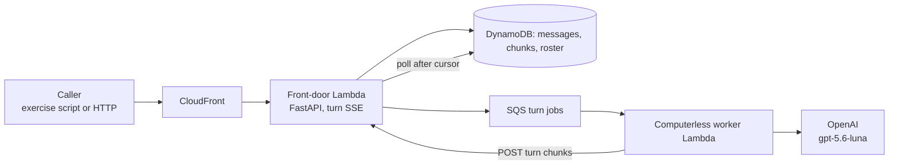
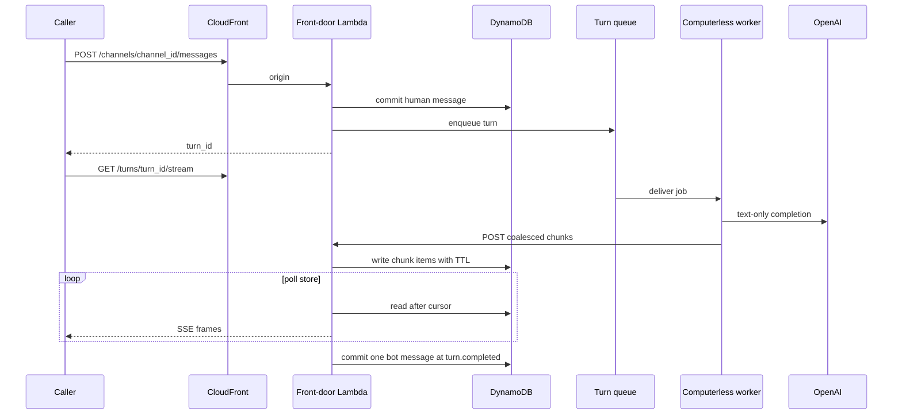
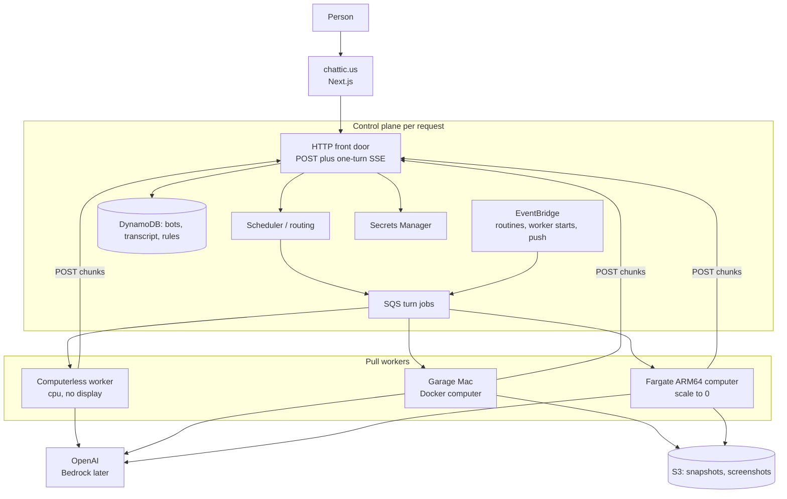

# Chatticus

Chatticus is a roster of named AI teammates that do real work on a computer
you control. You message a teammate. It uses tools, files, a browser, and a
shell. It comes back when something needs your approval.

The product lives at [chattic.us](https://chattic.us).

v1 is personal: one household, one AWS account, as many named bots as we
want. Every record already carries a `tenant_id` so the same system can
later serve other people without a rewrite.

## Named teammates and one computer

A **bot** is a persistent, named teammate. It keeps memory, preferences, and
conversation. It is not a fresh chat session on every task.

A **computer** is a Linux workplace with a browser, a filesystem, and a
terminal. It belongs to a **user**, not to a bot. Every bot on that user
shares `/workspace`, browser sessions, and command-line credentials so they
can hand work off. Each bot gets its own screen so they can work in parallel.
Separate bots are not a security boundary.

Work prefers **structured tools** (APIs, MCP servers, connectors) when they
exist. The computer's browser is the fallback for sites and apps that have no
clean API.

A **skill** is how to do a task. A **routine** is when to run it (a schedule
or an event). **Approvals** stop consequential actions: sending, purchasing,
publishing, deleting, and production changes.

Closing your laptop does not stop work. The computer runs on a worker, not
on the device in front of you.

## How a turn works

A **turn** is one bot response: from a human message (or a routine) until
the control plane commits a single bot message to the transcript.

There are no persistent sockets. The browser **POSTs a message** and then
reads **server-sent events scoped to that one turn**. Reconnecting is a new
SSE request that reads already-committed chunks after `Last-Event-Id`.
In-process queues are not the architecture.

The **control plane** is the AWS side that accepts HTTP, stores tenant
state, and enqueues jobs. It does not run the model loop and it does not
own a display. It holds no always-on process in the token path, so when
nobody is working, nothing bills. That idle floor is the point: a quiet
household (and later, quiet tenants) should not pay for capacity that is
sitting empty. There is never a load balancer in front of the API; an
hourly LB charge would recreate the floor this design avoids.

**Pull workers** register, heartbeat, and take jobs from a queue. The
control plane never SSHs into a garage Mac. A worker that has CPU and
network but no display, browser, or `/workspace` is **computerless**.
Text-only turns can finish there. The computer is **summoned when a tool
needs it**, not assumed at enqueue: reaching for a display, browser, or
`/workspace` escalates the same turn onto a computer-capable worker. No
second transcript.

See [Architecture](docs/ARCHITECTURE.md) for routing,
[Messaging](docs/MESSAGING.md) for the transcript and stream, and
[Design challenges](docs/DESIGN_CHALLENGES.md) for rejected alternatives.

## What is live today

GitHub **`main`** is **v0.2.0**. The live thin turn is the **development**
cloud environment: stack **ChatticusThinTurn** in AWS account
`335163751677` (`us-east-1`). Staging and production thin-turn stacks are
defined in CDK (`ChatticusThinTurnStaging`,
`ChatticusThinTurnProduction`) and are not deployed yet. Production is
never implied by a git branch; it is an explicit gated deploy of a
release that already passed staging acceptance.

The **source** on `main` also has turn **claim**, **lease**, and **fence**
so a duplicate queue delivery cannot start a second model call. That
ownership path is not the live AWS behavior until **development**
(**ChatticusThinTurn**) is redeployed from this tag.

What the deployed slice does today:

- CloudFront in front of a Lambda function URL (no load balancer).
- FastAPI front door: channels, messages, bots, a stopped-computer roster,
  chunk POST, and `GET /turns/{turn_id}/stream` as `text/event-stream`.
- DynamoDB is the source of truth for the transcript, in-flight chunks
  (TTL), and the thin roster. SSE **polls the store**, so the worker Lambda
  and the streaming function are not the same process.
- SQS carries one turn job. A computerless worker Lambda runs
  **gpt-5.6-luna** (OpenAI) and POSTs chunks back through the front door.
- Auth on this slice is an invoke key plus `X-Tenant-Id`, not product login.

**ChatticusSnapshots** and **ChatticusComputers** exist and must not be
destroyed. They are not on the turn path yet. The computer stays stopped.
There is no chattic.us web app, no local pull worker, no mid-turn
escalation, and no approvals on this slice.

Next on the board: recover interrupted turns without a second actor
(`e42008`), then redeploy so claim and fence are live (`ffcb11`).





## Where we are going

v1 is the chattic.us Next.js app talking to that same per-request control
plane, plus pull workers that can stay computerless or host the user's
Linux computer: local Docker when a Mac is on, Fargate ARM64 that scales
to zero when it is not. Workplace disk lives in S3 snapshots. EventBridge
will wake routines later. The model vendor is OpenAI; Amazon Bedrock may
follow.

Lambda is the right runtime for HTTP, auth callbacks, webhooks, routine
wake-ups, a computerless model loop, and holding **one turn's** SSE
stream. It is the wrong runtime for a workplace: it cannot hold a browser,
a display, or a session-lifetime connection. The computer is one Docker
image on Fargate, later stop/start EC2, or Docker on a Mac.



How a turn chooses a host:

1. A message or routine creates a turn job with `tenant_id`, required
   capabilities (`cpu`, and maybe `computer` / `browser` / `terminal`), and
   an optional `computer_id` pin.
2. Healthy workers pull. Prefer an already-warm cheap host (local Docker
   when the Mac is on), then a warm AWS computer, then a cold Fargate start.
3. The model loop runs **on the worker**, as soon as it has network and
   memory. Display, Chromium, and snapshot hydrate gate only the actions
   that need them.
4. Reaching for a computer tool escalates the same turn: the computerless
   attempt appends the pending tool call and a computer-capable worker
   continues. There is no `stop_computer`; the workplace is shared by all
   of a user's bots.
5. At `turn.completed` the control plane commits **one** message row.

## Persistence

Compute and disk are separate. The **computer** is a `computer_id`. The
**host** is whichever Mac, Fargate task, or EC2 instance is running it.

Canonical workplace disk (`/workspace` and the browser profile) is an **S3
snapshot**. Hosts hydrate a local cache, run, and publish. Relocate is an
administrator action: point the next host at that snapshot. There is no live
container move. See [Computer snapshots](docs/COMPUTER_SNAPSHOTS.md).

| State | Where it lives |
| --- | --- |
| Bot memory, skills, routines | DynamoDB |
| Transcript (append-only messages) | DynamoDB |
| In-flight turn chunks | DynamoDB, with a TTL; they expire after the turn commits |
| `/workspace` and browser profile | S3 snapshot; local volume / EBS / EFS as a host cache |
| Secrets | AWS Secrets Manager, never in the image |

Computer policy: `prefer_local`, `aws_only`, or `local_only`. Idle AWS
computers stop (EC2) or scale to 0 (Fargate). The snapshot stays.

## Repository

```
Chattic.us/
  features/                 Shared Gherkin (product narrative)
  python/                   Control plane, computerless worker, snapshot packer
  web/                      chattic.us web app (not on the live turn path yet)
  computer/                 Linux computer image
  infra/                    AWS CDK
  docs/                     Product, architecture, design challenges, stack
```

v1 language for the product brain is **Python**. The web app is
**TypeScript**. Gherkin in `features/` is the behavior spec.

## What you can run today

Local quality gates (CI uses a fake OpenAI client; a live key is not
required):

```bash
cd python
python3 -m venv .venv
source .venv/bin/activate
pip install -e ".[dev]"
behave
pytest
black --check src ../features tests
ruff check src ../features tests
```

The deployed thin turn is exercised against a **named cloud environment**
(CloudFront), not against an in-process queue:

```bash
cd python
python scripts/exercise_thin_turn.py --environment development
```

That resolves the front door from `CHATTICUS_DEVELOPMENT_BASE_URL`, SSM
`/chatticus/development/thin-turn/cloudfront-url`, or the
`CloudFrontUrl` output on stack `ChatticusThinTurn`. Pass `--base-url`
only when you already have the origin. Repeat with `--environment staging`
or `--environment production` when those stacks exist. GitHub workflow
**Acceptance** (`workflow_dispatch`) runs the same script. It is not run
on every `develop` push; dispatch it after a deploy, with
`CHATTICUS_<ENVIRONMENT>_BASE_URL` set. Staging and production choices
fail closed until those secrets (and stacks) exist.

If Docker Desktop is running, the snapshot packer can be checked with
`sh computer/test_relocate.sh`.

AWS resources are CDK only (`infra/`). Do not create them in the console.
`cdk deploy --all` would touch **ChatticusSnapshots**,
**ChatticusComputers**, and every thin-turn environment; never do that.
Deploy one named stack:

```bash
cd infra
npx cdk deploy ChatticusThinTurn
npx cdk deploy ChatticusThinTurnStaging
npx cdk deploy ChatticusThinTurnProduction
```

**ChatticusThinTurn** is development. Staging and production are separate
stacks with their own DynamoDB, SQS, Lambda, and CloudFront. Do not
destroy the snapshot or computer stacks.

Postgres in `docker-compose.yml` is unused (it predates DynamoDB).

## Task tracking

This repository uses [Kanbus](https://github.com/AnthusAI/Kanbus). Prefer
`kbs` when it is on `PATH`. See [CONTRIBUTING_AGENT.md](CONTRIBUTING_AGENT.md).

```bash
kbs list
kbs create "Describe the work" --type task
```

At **every milestone** (a slice merged to `develop`, a promote to `main`, a
deploy, a closed epic, or anything that changes what is true), **launch a
sub-agent** whose only job is housekeeping. That agent comments on the
Kanbus issues it touches, sets statuses to match reality, **creates new
issues** for significant work that appeared, and **rewrites the "What is
live today" section of this README** (and the next-up line) so a new reader
is not looking at last week's world. Do not skip that pass. Do not treat it
as a leftover for the implementation agent.

## Documentation

- [Product](docs/PRODUCT.md)
- [Architecture](docs/ARCHITECTURE.md)
- [Messages and the cloud API](docs/MESSAGING.md)
- [Design challenges](docs/DESIGN_CHALLENGES.md)
- [Computer snapshots](docs/COMPUTER_SNAPSHOTS.md)
- [Stack](docs/STACK.md)
- [Roadmap](docs/ROADMAP.md)
- [Threat model](docs/THREAT_MODEL.md)
- [Tasks](docs/TASKS.md)
- [Feasibility tests](docs/FEASIBILITY_TESTS.md)
- [AGENTS.md](AGENTS.md) for coding agents working in this repo
