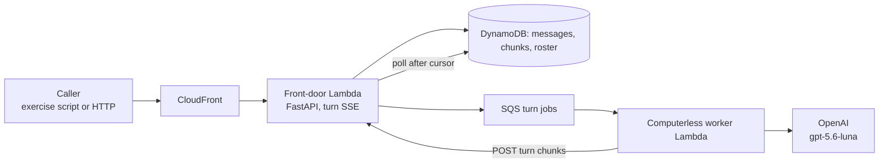
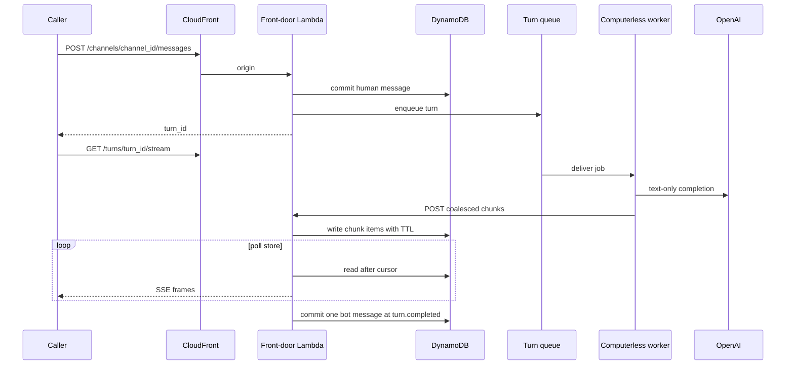
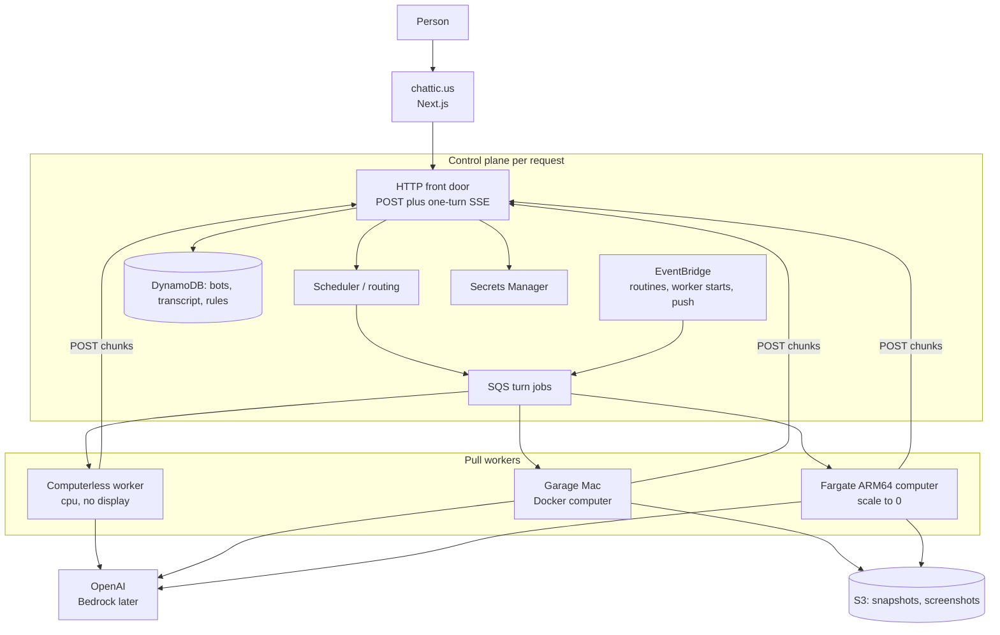

# Chatticus

Chatticus is a roster of named AI teammates that do real work on a computer
you control. You message a teammate. It uses tools, files, a browser, and a
shell. It comes back when something needs your approval.

The product lives at [chattic.us](https://chattic.us).

v1 is personal: one household, one AWS account, as many named bots as we
want. Every record already carries a `tenant_id` so the same system can
later serve other people without a rewrite.

## Named teammates and one computer

A **bot** is a persistent, named teammate. It keeps memory, preferences, and
conversation. It is not a fresh chat session on every task.

A **computer** is a Linux workplace with a browser, a filesystem, and a
terminal. It belongs to a **user**, not to a bot. Every bot on that user
shares `/workspace`, browser sessions, and command-line credentials so they
can hand work off. Each bot gets its own screen so they can work in parallel.
Separate bots are not a security boundary.

Work prefers **structured tools** (APIs, MCP servers, connectors) when they
exist. The computer's browser is the fallback for sites and apps that have no
clean API.

A **skill** is how to do a task. A **routine** is when to run it (a schedule
or an event). **Approvals** stop consequential actions: sending, purchasing,
publishing, deleting, and production changes.

Closing your laptop does not stop work. The computer runs on a worker, not
on the device in front of you.

## How a turn works

A **turn** is one bot response: from a human message (or a routine) until
the control plane commits a single bot message to the transcript.

There are no persistent sockets. The browser **POSTs a message** and then
reads **server-sent events scoped to that one turn**. Reconnecting is a new
SSE request that reads already-committed chunks after `Last-Event-Id`.
In-process queues are not the architecture.

The **control plane** is the AWS side that accepts HTTP, stores tenant
state, and enqueues jobs. It does not run the model loop and it does not
own a display. It holds no always-on process in the token path, so when
nobody is working, nothing bills. That idle floor is the point: a quiet
household (and later, quiet tenants) should not pay for capacity that is
sitting empty. There is never a load balancer in front of the API; an
hourly LB charge would recreate the floor this design avoids.

**Pull workers** register, heartbeat, and take jobs from a queue. The
control plane never SSHs into a garage Mac. A worker that has CPU and
network but no display, browser, or `/workspace` is **computerless**.
Text-only turns can finish there. The computer is **summoned when a tool
needs it**, not assumed at enqueue: reaching for a display, browser, or
`/workspace` escalates the same turn onto a computer-capable worker. No
second transcript.

See [Architecture](docs/ARCHITECTURE.md) for routing,
[Messaging](docs/MESSAGING.md) for the transcript and stream, and
[Design challenges](docs/DESIGN_CHALLENGES.md) for rejected alternatives.

## What is live today

**2026-08-31:** `ChatticusDns`, all three `ChatticusWeb*` stacks, and matching
`ChatticusThinTurn*` stacks are deployed in `us-east-1`. Same-origin HTTPS
is live at `dev.chattic.us`, `staging.chattic.us`, `chattic.us`, and
`www.chattic.us`. SSM `/chatticus/{environment}/thin-turn/cloudfront-url`
is `https://{hostname}/api` for each environment. A development run of
`exercise_thin_turn.py` against `https://dev.chattic.us/api` exited 0 on
2026-08-31 after the web stack fix (CloudFront `/api*` routing and API error
passthrough). GitHub **Deploy ThinTurn (development)** and **Deploy Web
(development)** are manual (`workflow_dispatch`, see `infra/README.md`) and
need the `development` environment secret `AWS_DEPLOY_ROLE_ARN` from
`ChatticusGitHubDeploy`. After merging OIDC trust updates, redeploy
`ChatticusGitHubDeploy` once before the web workflow can assume the role;
live workflow runs remain human-gated.

GitHub **`main`** is `ede89c8` (PR #37, 2026-08-31): git promotion of
the completed computer-turn pin (`822954b` / PR #34), not a stack
redeploy. Production is never implied by a git branch. Staging and
production were last recorded as deployed from `760915d` (v0.5.0).

Development **ChatticusThinTurn** last **ThinTurn-only** CDK pin is
**2026-08-31T16:02:57Z** (PR #34, ECS host-start context). Live
ComputerWorker has `CHATTICUS_HOST_STARTER=ecs` and
`CHATTICUS_ECS_HOST_COMMAND` for the host worker. **ChatticusWeb** can
still restack ThinTurn; this pin looks up the live ChatticusComputers
stack at synth so a Web restack cannot drop `ecs:RunTask`.
**ChatticusComputers** was not redeployed (`desiredCount` remains 0).
GitHub Actions must not hit live AWS.

A named `exercise_thin_turn.py --environment development` run after that
CDK pin exited 0 with `health_environment=1`, `missing_claim=404`,
`claim_a=200` then `claim_b=409`, `host_start_generation=1`,
`computer_queue_job=completed`, and `computer_queue_turn_completed=1`.
Leftover RunTask was stopped; desiredCount stayed 0. That is a completed
computer continuation after a real ThinTurn-only CDK deploy, not a
CLI-patched Lambda env. `dev.chattic.us` DNS may still fail; resolve the
front door from SSM, CloudFormation, or `CHATTICUS_DEVELOPMENT_BASE_URL`.
A demo CLI (Kanbus epic 35d86b) is a separate slice.
`exercise_thin_turn.py` stays the pass/fail gate.

Per-account CloudFront distribution domains, Lambda function URLs, and
AWS account ids belong in gitignored `AGENTS.local.md`, not in this
file. Resolve the front door from SSM, CloudFormation, or
`CHATTICUS_*_BASE_URL`.

| Environment | Web stack | Site | API base (same origin) |
| --- | --- | --- | --- |
| development | `ChatticusWeb` | https://dev.chattic.us | https://dev.chattic.us/api |
| staging | `ChatticusWebStaging` | https://staging.chattic.us | https://staging.chattic.us/api |
| production | `ChatticusWebProduction` | https://chattic.us | https://chattic.us/api |

Deploy DNS once (`infra/deploy-chatticus-dns.sh`), set registrar name servers
to the stack **NameServers** output, then deploy thin-turn + web per environment.
Until DNS propagates, pass `--base-url` with the CloudFront distribution domain
from stack outputs (record it in gitignored `AGENTS.local.md`, not in the repo).

If SSM or CloudFormation credentials are expired, set
`CHATTICUS_{ENVIRONMENT}_BASE_URL` or pass `--base-url`. SQS queue checks still need
`aws login`.

`cd python && sh scripts/live_aws_thin_turn.sh development` (same gate as
`python scripts/exercise_thin_turn.py --environment development`) is the
named-environment command re-proven on 2026-08-31 (claim **200** then
**409**, `host_start_generation=1`, in-flight nack after ChatticusWeb
wiped ComputerWorker RunTask). Staging and
production last recorded a passing named exercise on the v0.5.0 pin;
they were not re-proven on this pass. A development run includes
missing-turn claim **404** and a live second-worker claim **409**
while the lease is held (`claim_a=200` then `claim_b=409`, because the
fence probe starts the turn with `enqueue_turn=false` so the
computerless worker does not race the claim), plus **development** naming
itself on `GET /health` (`health_environment=1`), a live idempotent
channel post (`post_idempotent=1`: two `POST /channels/{id}/messages` with
the same `Idempotency-Key` produce one row), a duplicate bot create
(`bot_name_dup=1`: a second `POST /bots` with the same name returns
**400**), a live idempotent channel open (`channel_idempotent=1`: two
`POST /channels` with the same `Idempotency-Key` return one channel), a live
`GET /channels/{id}` roundtrip (`channel_get=1`), plus a live bot-memory
roundtrip (`POST /bots/{id}/memory` then `GET /bots/{id}`), a live
idempotent bot create (`bot_idempotent=1`: two `POST /bots` with the same
`Idempotency-Key` return one bot_id), a live named-bot lookup
(`bot_by_name=1`: `GET /bots?user_id=&name=` returns that bot_id), a live user bot list
(`bots_list=1`: `GET /users/{user_id}/bots` includes that bot_id), a live user channel list
(`channels_list=1`: `GET /users/{user_id}/channels` includes that channel_id), a live household computer read
(`computer_get=1`: `GET /users/{user_id}/computer` returns `computer_id`, `stopped=true`, and `host_start_generation`), a live channel active-turn read
(`channel_turn=1`: `GET /channels/{id}/turn` returns the fence-probe turn_id), a live user active-turn list
(`turns_list=1`: `GET /users/{user_id}/turns` includes that turn_id), a live waiting-turn read
(`channel_turn_waiting=1`: that path returns `waiting_for=browser` after the fence probe waits), a live empty active-turn read
(`channel_turn_done=1`: after the greeting completes, `GET /channels/{id}/turn` is **404**), plus SSE `turn.started` /
`turn.token` / `turn.completed`. **Development** also drops that greeting stream after
`turn.started` and a token, then reconnects through CloudFront with
`Last-Event-ID` and requires ordered replay through `turn.completed`.
After the greeting completes, **development** also lists channel history
with `GET /channels/{id}/messages?after=<seq>` and requires only later
rows, and lists the durable turn journal with
`GET /turns/{id}/events?after=<seq>` through `turn.completed`.
**Development** also proves `POST /turns/{id}/waiting`:
SSE `turn.waiting` naming `browser`, `GET /turns/{id}` returning
`waiting_for=browser` and pending tool `request_computer_capability`,
then a stale fence **409**, then
`POST /turns/{id}/resume` **409** while the household computer is stopped.
The fence probe also requires durable `turn.waiting` journal events to carry
`pending_computer_tool` with the same `action_id` as `GET /turns/{id}`. The same named exercise then asks luna to open the household browser; the
worker emits `turn.waiting` instead of completing, `GET /turns/{id}` still
names `browser` and the pending computer tool, the journal event matches that
`action_id`, and resume is **409** again. It then marks the computer
running, resumes that turn, checks `POST /turns/{id}/resume` returns
`required_capabilities=computer`, polls `GET /users/{id}/computer` until
`host_start_generation>=1`, and receives the continuation from
`ComputerTurnJobs` (not the cpu queue) as an in-flight nack, draining leftover
messages from interrupted runs, before marking the computer stopped. Staging
and production do not have waiting, resume, or turn read yet.

The **source** has named cloud environments, turn **claim**, **lease**,
**fence**, durable channel lookup across Lambda invocations, a durable
logical-enqueue ledger, EventBridge Scheduler one-shot turn deadlines,
and a recovery kernel (`recovery_enabled` when the messaging table and
scheduler env vars are set). Kernel tests cover turn-boundary fault
injection and in-memory page-content authority containment plus the
executable capability, egress, and browser-context policy kernel (not
wired into the live worker HTTP loop).

What each deployed thin-turn slice does today:

- CloudFront in front of a Lambda function URL (no load balancer).
- FastAPI front door: `GET /health` (names the cloud environment on
  development), channels (`GET /channels/{id}`, `POST /channels`,
  `GET /users/{user_id}/channels`, `GET /users/{user_id}/turns`, and `GET /channels/{id}/turn`),
  messages, bots (`GET /bots?user_id=&name=` and `GET /users/{user_id}/bots`),
  the household computer (`GET /users/{user_id}/computer`),
  a stopped-computer roster,
  chunk POST, `POST /turns/{id}/claim`, `POST /turns/{id}/renew`, fenced
  chunk writes, `POST /turns/{id}/waiting` (development),
  `POST /turns/{id}/resume` (development; **409** while the computer is
  stopped; **200** with `required_capabilities` when running), `GET /turns/{id}` (development; exposes `waiting_for` and
  the pending `request_computer_capability` call), and
  `GET /turns/{turn_id}/stream` as `text/event-stream`.
- Channel records and named bots are in DynamoDB, so a different Front Door
  instance can enqueue a turn for a bot it did not create. Per-user bot
  names are reserved on the roster table so a recycled Lambda cannot fork
  two bots with the same name. A recycled Front Door can list a user's
  named bots and channels from that roster. A recycled Front Door can also
  read the household computer id and stopped flag. A recycled Front Door
  can read the active turn on a channel without a remembered turn_id, and
  list a user's in-flight turns the same way. A recycled Front Door can
  also read `GET /bots/{id}` (including memory), `GET /turns/{id}`,
  channel history with `after=`, and the turn journal with `after=`.
  Bot memory is
  stored on that roster item; a recycled Front Door hydrates the bot from
  Dynamo before writing memory. The computerless worker prompt is that
  memory plus the channel transcript. Another bot on the same computer
  does not inherit it.
- DynamoDB is the source of truth for the transcript, in-flight chunks
  (TTL), and the thin roster. SSE **polls the store**. Retrying
  `POST /channels` or `POST /channels/{id}/messages` or `POST /bots` with the same
  `Idempotency-Key` returns the original channel, message, turn, or bot after
  Front Door recycle.
- SQS carries one turn job. A computerless worker Lambda runs
  **gpt-5.6-luna** (OpenAI). A text-only reply still completes. If the
  model calls `request_computer_capability`, the worker POSTs
  `turn.waiting`, records `waiting_for` and the pending computer tool on
  the turn and in the durable journal event, and leaves the turn active instead of claiming the browser
  work is done. A later computerless delivery of that same turn does not
  claim it or call the model again. Resume while the computer is marked
  running records a computer-required continuation on a dedicated SQS
  queue the cpu worker does not consume, so the pending tool survives
  Front Door recycling. If such a job still reached a computerless
  worker, it is refused without ack. Resume of that
  same turn is refused while the computer is stopped. EventBridge deadline
  recovery does not fail a turn that is legitimately waiting on a gate.
- Auth on this slice is an invoke key plus `X-Tenant-Id`, not product login.

Worker lease renew during long model calls is live on development.
EventBridge Scheduler one-shots are on each front door
(`chatticus-{environment}-turn-deadlines`); `recovery_enabled` is on.
Warm Front Door containers use a wall clock, so deadlines land in the
future. A wedged turn has recovered through EventBridge without a
forced Lambda cold start on development. GitHub **`main`** carries the
2026-08-31 development live pin; overnight, approval binding,
unbound-browser, and full computer-handoff execution still are not on
the live worker loop. Do not merge `develop` to `main` as daily parking.

**ChatticusSnapshots** and **ChatticusComputers** exist and must not be
destroyed. Development ComputerWorker may `ecs:RunTask` into that cluster
with desired count still 0. Cold Fargate time to `RUNNING` for the
current computer image is tens of seconds (Test 2). Chromium is in the
image and is not wired as the live `ComputerActionExecutor`. The
chattic.us Next.js UI deploys via `ChatticusWeb*` stacks (infra README);
it is not on the live turn path until DNS and deploy land. There is no
pull worker that finishes a browser tool on a running host, and no
approvals on these slices.

Cloud-environment epic 9eef23 is closed: three named stacks, named-env
acceptance on each. Turn recovery epic 653989 is closed. Cold Fargate
readiness (e747d7, Test 2) is measured for the current image: tens of
seconds to RUNNING; Chromium is in the image. Remaining for summoning a
computer (8f98f8): a Chromium executor and host-readiness gate on the
ephemeral Fargate task so ComputerTurnJobs can finish instead of nacking
`ComputerWorkerHostNotReady`; `host_start_generation` is already live.
Structured handoff (538d28) is
kernel-only on `develop` — model.request, tool.call, tool.result, and
attempt claim/relinquish are durable typed journal events; continuation
executes only unresolved action ids; failure injection covers handoff
boundaries and computer reclamation. Gherkin:
`structured_journal_handoff.feature` and
`computer_continuation_worker.feature`. Single-owner computer
start and readiness (53beb0) is kernel-only on `develop`: one
tenant/computer start claim, lease expiry and reclaim, per-capability
readiness recording, and stale-local prefer-local gating until snapshot
reconciliation. Gherkin: `single_computer_start.feature`,
`computer_host_readiness.feature`, plus `capability_gated_readiness.feature`.
Waiting-turn resume while the computer is stopped (66d3c4), waiting-turn gate read over HTTP (dfa7a9), pending
computer tool on the waiting turn (96c0e8), waiting journal snapshot
(d04942), computerless skip of a waiting turn (86c75d), computerless
refuse of a computer continuation (0b30dc), keeping computer
continuations off the cpu queue (f861ee), and a dedicated computer
turn queue with no worker attached yet (5c7e77), and a named-exercise
receive of that computer continuation from SQS (10ec55) are live on
development. Overnight gated-action
(5b687a), immutable approval binding (2b293d), unbound browser stops
(813d8d), computer-seam recovery (b41106), capability-gated readiness
(`turn.waiting`, c0fbf0), same-turn first computer tool (d3908f), and
single shared computer start (b6ab7d) are kernel-only; the
unattended-gate decision is in [Approval spec](docs/APPROVAL.md)
(76d3e2). They are not on the live worker loop.





## Where we are going

v1 is the chattic.us Next.js app talking to that same per-request control
plane, plus pull workers that can stay computerless or host the user's
Linux computer: local Docker when a Mac is on, Fargate ARM64 that scales
to zero when it is not. Workplace disk lives in S3 snapshots. EventBridge
will wake routines later. The model vendor is OpenAI; Amazon Bedrock may
follow.

Lambda is the right runtime for HTTP, auth callbacks, webhooks, routine
wake-ups, a computerless model loop, and holding **one turn's** SSE
stream. It is the wrong runtime for a workplace: it cannot hold a browser,
a display, or a session-lifetime connection. The computer is one Docker
image on Fargate, later stop/start EC2, or Docker on a Mac.



How a turn chooses a host:

1. A message or routine creates a turn job with `tenant_id`, required
   capabilities (`cpu`, and maybe `computer` / `browser` / `terminal`), and
   an optional `computer_id` pin.
2. Healthy workers pull. Prefer an already-warm cheap host (local Docker
   when the Mac is on), then a warm AWS computer, then a cold Fargate start.
3. The model loop runs **on the worker**, as soon as it has network and
   memory. Display, Chromium, and snapshot hydrate gate only the actions
   that need them.
4. Reaching for a computer tool escalates the same turn: the computerless
   attempt appends the pending tool call and a computer-capable worker
   continues. There is no `stop_computer`; the workplace is shared by all
   of a user's bots.
5. At `turn.completed` the control plane commits **one** message row.

## Persistence

Compute and disk are separate. The **computer** is a `computer_id`. The
**host** is whichever Mac, Fargate task, or EC2 instance is running it.

Canonical workplace disk (`/workspace` and the browser profile) is an **S3
snapshot**. Hosts hydrate a local cache, run, and publish. Relocate is an
administrator action: point the next host at that snapshot. There is no live
container move. See [Computer snapshots](docs/COMPUTER_SNAPSHOTS.md).

| State | Where it lives |
| --- | --- |
| Bot memory, skills, routines | DynamoDB |
| Transcript (append-only messages) | DynamoDB |
| In-flight turn chunks | DynamoDB, with a TTL; they expire after the turn commits |
| `/workspace` and browser profile | S3 snapshot; local volume / EBS / EFS as a host cache |
| Secrets | AWS Secrets Manager, never in the image |

Computer policy: `prefer_local`, `aws_only`, or `local_only`. Idle AWS
computers stop (EC2) or scale to 0 (Fargate). The snapshot stays.

## Repository

```
Chattic.us/
  features/                 Shared Gherkin (product narrative)
  python/                   Control plane, computerless and computer workers, snapshot packer
  web/                      chattic.us web app (not on the live turn path yet)
  computer/                 Linux computer image
  infra/                    AWS CDK
  docs/                     Product, architecture, design challenges, stack
```

v1 language for the product brain is **Python**. The web app is
**TypeScript**. Gherkin in `features/` is the behavior spec.

## What you can run today

Local quality gates (CI uses a fake OpenAI client; a live key is not
required):

```bash
cd python
python3 -m venv .venv
source .venv/bin/activate
pip install -e ".[dev]"
behave
pytest
black --check src ../features tests
ruff check src ../features tests
```

`black` and `ruff` versions are pinned in `python/pyproject.toml` so local
`pip install -e ".[dev]"` matches GitHub CI.

The deployed thin turn is exercised against a **named cloud environment**
(CloudFront), not against an in-process queue. GitHub CI (`behave`,
`pytest`) uses in-memory stores and moto. Live AWS is a local command
after `aws login`:

```bash
cd python
sh scripts/live_aws_thin_turn.sh development
```

That is the same as
`python scripts/exercise_thin_turn.py --environment development` plus an
identity check. It resolves the front door from
`CHATTICUS_DEVELOPMENT_BASE_URL`, SSM
`/chatticus/development/thin-turn/cloudfront-url`, or the
`CloudFrontUrl` output on stack `ChatticusWeb` (or `ChatticusThinTurn`
before the web stack exists). When AWS lookup fails, pass `--base-url` or
set the env var (see gitignored `AGENTS.local.md`). SQS queue checks
need that same AWS identity. Repeat with `staging` or `production` when
you mean those stacks. It does not scale Fargate. Do not run this from
GitHub Actions.

If Docker Desktop is running, the snapshot packer can be checked with
`sh computer/test_relocate.sh`.

AWS resources are CDK only (`infra/`). Do not create them in the console.
`cdk deploy --all` would touch **ChatticusSnapshots**,
**ChatticusComputers**, and every thin-turn environment; never do that.
Deploy one named stack:

Deploy development ThinTurn only:

```bash
cd infra
sh deploy-chatticus-thinturn-development.sh
```

That fails closed without AWS identity and never passes `--all`. Staging
and production, when you mean those stacks:

```bash
npx cdk deploy ChatticusThinTurnStaging
npx cdk deploy ChatticusThinTurnProduction
```

**ChatticusThinTurn** is development. Staging and production are separate
stacks with their own DynamoDB, SQS, Lambda, and CloudFront. GitHub
`main` includes the 2026-08-31 development live pin; PR #34 adds
Computers-stack lookup so Web restacks keep ECS host-start. Do not merge
`develop` to `main` as parking. Staging and production stacks were last
recorded from `760915d`. Do not destroy the snapshot or computer stacks.

Postgres in `docker-compose.yml` is unused (it predates DynamoDB).

## Task tracking

This repository uses [Kanbus](https://github.com/AnthusAI/Kanbus). Prefer
`kbs` when it is on `PATH`. See [CONTRIBUTING_AGENT.md](CONTRIBUTING_AGENT.md).

```bash
kbs list
kbs create "Describe the work" --type task
```

At **every milestone** (a slice merged to `develop`, a promote to `main`, a
deploy, a closed epic, or anything that changes what is true), **launch a
sub-agent** whose only job is housekeeping. That agent comments on the
Kanbus issues it touches, sets statuses to match reality, **creates new
issues** for significant work that appeared, and **rewrites the "What is
live today" section of this README** (and the next-up line) so a new reader
is not looking at last week's world. Do not skip that pass. Do not treat it
as a leftover for the implementation agent.

## Documentation

- [Product](docs/PRODUCT.md)
- [Architecture](docs/ARCHITECTURE.md)
- [Messages and the cloud API](docs/MESSAGING.md)
- [Design challenges](docs/DESIGN_CHALLENGES.md)
- [Computer snapshots](docs/COMPUTER_SNAPSHOTS.md)
- [Stack](docs/STACK.md)
- [Roadmap](docs/ROADMAP.md)
- [Approval spec](docs/APPROVAL.md)
- [Browser authority](docs/BROWSER_AUTHORITY.md)
- [Threat model](docs/THREAT_MODEL.md)
- [Tasks](docs/TASKS.md)
- [Feasibility tests](docs/FEASIBILITY_TESTS.md)
- [AGENTS.md](AGENTS.md) for coding agents working in this repo
