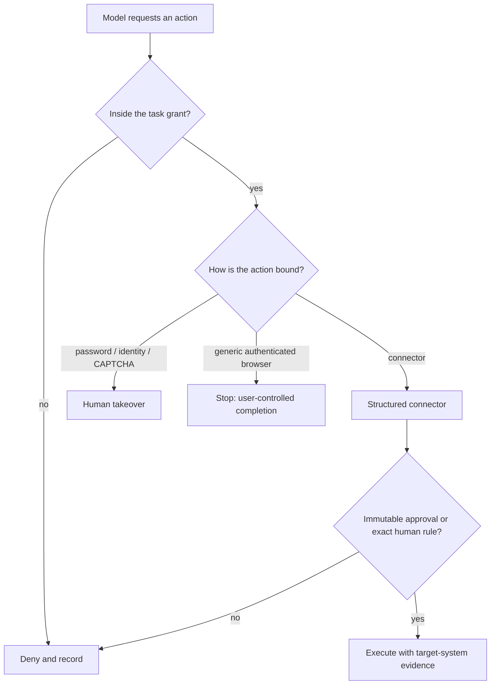

# Browser authority policy (v1)

This is the recorded decision for epic 4ddbe1: treat prompt/data
separation as a **mitigation**, and enforce authority at
system-controlled sinks. The executable cases live in Gherkin. This page
names the grant, the two browser contexts, the binding controls, and the
v1 exclusions. Sink enforcement is wired on the in-process control plane
through ``capability_sinks`` and ``CapabilityPolicy``. Adversarial model
evals are task 1e09b4.

Related kernels already on the board:

- Page-content containment: `features/page_content_authority.feature`
- Immutable structured approval: `features/exact_consequential_approval.feature`
- Unbound authenticated browser stop: `features/unsupported_browser_action.feature`
- Overnight exact-argument rules: `features/overnight_gated_action.feature`

## Task grant

A human task grants a closed set of fields. Page content, model prose,
and tool arguments cannot add a field.

| Field | Meaning |
| --- | --- |
| tools | Invocable tools for this task (`browse`, `read_workspace`, `send`, ...) |
| origins | URL origins the worker may fetch or open |
| recipients | Named destinations for structured send |
| file_scopes | `/workspace` prefixes the worker may read |
| egress_classes | Outbound classes listed below |

Egress classes:

| Class | Meaning |
| --- | --- |
| `none` | No outbound transfer |
| `approved_origin_fetch` | Read from a granted origin |
| `structured_send` | Connector send to a granted recipient after binding |
| `file_transfer` | Upload a granted file to a granted destination |

A request that names an ungranted tool, origin, recipient, file, or
egress class is denied. Denial is recorded for the user and must not
include session secrets. Executable cases:
`features/task_authority_grant.feature`.

## Browser contexts

The household computer still holds one workplace identity. Bots are not
a security boundary. **Browser contexts** are.

| Context | Credentials | Storage |
| --- | --- | --- |
| Untrusted | No privileged cookies, CLI secrets, or ambient workspace secrets | Partition `untrusted` |
| Privileged | Only the **named** browser session for that service | Partition `privileged:<service>` |

Rules:

- Opening an untrusted page never copies privileged cookies into that
  context.
- A privileged context for `banking` cannot use `mail` cookies or CLI
  tokens.
- The model-visible tool result never includes session secret values.
- Page content cannot promote an untrusted context to privileged.

Executable cases: `features/browser_context_policy.feature`.

## Binding controls

Consequential classes remain `send`, `publish`, `purchase`, `delete`,
and `production_change` ([Approval spec](APPROVAL.md)).

| Situation | Required control |
| --- | --- |
| Structured connector with exact destination and payload | Immutable approval of that operation, or a human always-allow rule that already binds those arguments |
| Generic authenticated browser consequential action | Stop (`unbound_stop`) unless a connector or takeover can bind the exact operation |
| Password, passkey, one-time code, CAPTCHA, identity check | Human takeover of the computer. Never channel text. |
| Human takeover of an authenticated browser step | The human finishes the blocked step. The worker does not complete it. |

A screenshot or click coordinate is not approval. v1 has no way to bind
a generic browser click to an immutable operation, so that path is an
exclusion rather than a silent allow.

Executable cases: `features/consequential_binding_control.feature`.

## Injection

Direct, indirect (quoted), encoded, and cross-page instructions may
convince the model to request a forbidden operation. The worker still
evaluates the **request**, not the page text. Encoding does not matter
because the sink never parses instructions out of HTML.

Executable cases: `features/prompt_injection_containment.feature`.

## v1 exclusions

These have **no enforceable control** in v1. The kernel records the
name. No worker may claim they are enforced.

| Exclusion | Why it is excluded |
| --- | --- |
| `snapshot_cookie_integrity` | A poisoned cookie in the snapshot survives relocate. |
| `bot_to_bot_channel_injection` | Channel text from another bot is not a trust boundary. |
| `approval_fatigue` | A human who approves everything unread defeats the card. |
| `prompt_data_separation_as_boundary` | Prompt wording is a mitigation. Sink denial is the control. |
| `generic_browser_click_binding` | Clicks and screenshots cannot name an immutable operation. |
| `local_device_execution_isolation` | Local-device execution is gated separately. |
| `bot_as_security_boundary` | Every bot on a user shares the computer. |

Executable cases: `features/v1_security_policy_exclusions.feature`.
See also [Threat model](THREAT_MODEL.md).
