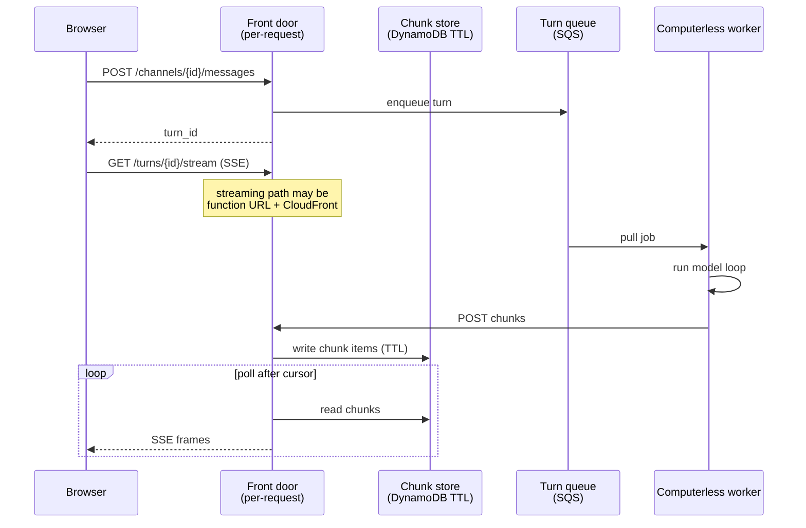

# Messages and the cloud API

This describes the decided design for the transcript and the streaming
path. The reasoning behind each choice, including what was rejected and
why, is in [Design challenges](DESIGN_CHALLENGES.md). The channel model is settled there;
this describes it.

Chattic.us is a conversation surface. The control plane is the only
thing that writes the transcript and the only thing the browser talks
to. Workers never notify the web app. Bots never HTTP-call each other.

**There are no persistent sockets in Chatticus.** Not from the browser,
not from the worker. Everything is a request, and the longest-lived
request is one turn.

## Message store

DynamoDB is the source of truth for conversations. S3 holds blobs
(screenshots, attachments). The computer snapshot is not the chat log.

A **channel** is one conversation. It belongs to one `tenant_id` and one
user. Participants are that human and one or more of that user's bots.

**Messages are append-only.** Each channel has a monotonically increasing
`seq`, assigned by the control plane at commit, which makes order within
a channel total. Clients reconnect with
`GET /channels/{channel_id}/messages?after=seq`. Edits and deletes are out
of scope for v1.

| Field | Role |
| --- | --- |
| `tenant_id` | Isolation. Required on every item. |
| `seq` | Per-channel order. Replay cursor. |
| `author_kind` | `human` or `bot` |
| `author_id` | `user_id` or `bot_id` |
| `body` | Committed text. Not a token. |
| `addressed_to_bot_id` | If set, the control plane enqueues a turn for that bot |

Files stay on the shared computer. A message may name a path under
`/workspace`. It does not copy the file into the transcript.

### A bot's input is memory plus the channel

A channel is shared; bot memory is not. They compose at turn start:

> **A bot's model input is its own memory plus the channel's compacted
> view.**

Every bot on a channel reads the whole channel. Only the addressed bot
acts. Bot memory is per-bot and spans channels; the channel is compacted
once and serves every participant. See challenge 4 in
[Design challenges](DESIGN_CHALLENGES.md).

### In-flight chunks live in the same store, with a TTL

A turn's partial output is not a message. It is a short-lived item keyed
by turn and sequence, carrying a TTL of hours, written by the worker and
read by whatever is streaming. At `turn.completed` the control plane
commits **one** message row with the joined text; the chunks then expire
on their own.

| Item | Lifetime | Written by |
| --- | --- | --- |
| Turn chunk | TTL, hours | Worker, through the front door |
| Committed message | Permanent | Control plane, at `turn.completed` |

Keep the two item types distinguishable so "messages are immutable and
permanent" has no asterisk. Do not insert a message row per token.

## Bot to bot

There is one message table. Bot-to-bot is not a second bus, queue, or
protocol.

1. A bot posts a message in a channel the human can already see.
2. The message is addressed to another bot on that channel.
3. The control plane enqueues a turn for the recipient, same as a human
   message would.
4. The recipient's worker pulls the job. It does not receive an inbound
   HTTP call from the other bot.

The human is not the router. The human still sees the same channel.

## The cloud API

Nothing bills while nobody is working. The API is per-request, and the
only thing that lives longer than a request is a turn.

The front door bills per request and has no hourly floor: an API Gateway
HTTP API, or a function URL behind CloudFront. **Never a load balancer.**
An ALB's hourly floor costs more than the always-on container this design
exists to avoid.

### How the web app is notified

1. The browser POSTs a message and gets back a `turn_id`.
2. It opens `GET /turns/{turn_id}/stream` and reads server-sent events.
3. The worker pulls the job, runs the model loop, and POSTs coalesced
   chunks (roughly every 250 milliseconds, not one per token). It starts
   the model loop as soon as it has network and memory; it does not wait
   for a display or a hydrated workspace it may never use.
4. The streaming function polls for chunks after its cursor and writes
   them out as events.
5. On `turn.completed` one message row is committed. The client reloads
   or reconciles with `GET .../messages?after=<seq>`.

The stream is scoped to **one turn**, not to the tab. Between turns the
browser holds nothing open, which is what lets the whole system reach
zero. A tab with no active turn learns about work finished by a routine
through device push, or a cheap "anything after seq?" poll every 20 to
30 seconds. Push cannot carry a token stream; it is only "come back,
something finished".

Streaming functions have a maximum duration (15 minutes on Lambda). A
longer turn ends the stream; the client reconnects with `Last-Event-ID`
and a fresh invocation resumes. Reconnect is a normal event, not an error
path.

The client should render each chunk smoothly across the following
interval. The up-to-250-millisecond delivery jitter is then invisible.

### Approvals travel by POST

Approvals are rare and human-initiated, so they do not need a duplex
connection. `approval.required` arrives on the stream (or on the next
poll); the human's decision is an ordinary POST. This is why
server-sent events are sufficient and a WebSocket is not needed.

### Events

| Kind | When | Stored as a message? |
| --- | --- | --- |
| `channel.message.created` | A row is committed | yes, that row |
| `turn.started` | A bot turn begins streaming | no |
| `turn.waiting` | The turn is blocked on a readiness gate, naming which (for example a computer still booting) | no |
| `turn.token` | One coalesced chunk | no |
| `turn.completed` | Chunks are joined into one row | yes, one row |
| `approval.required` | A proposed action is blocked | the proposal, not the action |

### Waiting is a state, not dead air

A cold computer delays a bot's first *computer action*. It must not
delay the bot's first *word*. When a turn does block on a readiness
gate, it emits `turn.waiting` naming what it is waiting for, so the web
app can show "starting your computer" rather than a spinner that is
indistinguishable from a hang.

See challenge 5 in [Design challenges](DESIGN_CHALLENGES.md).

### The invariant

> The stream is ephemeral and fully re-derivable from the store. The
> work is durable and never depends on anyone watching.

A turn runs to completion whether or not a browser is attached. The
stream is a view, never a participant. If the stream ever carries state
that cannot be recovered through `Last-Event-ID`, reconnect becomes a bug
and the guarantee that closing the laptop does not stop work is gone.

### What the cloud API is not

- **No WebSocket**, browser-side or worker-side. A socket that lives as
  long as a chat tab needs a process that lives as long as a chat tab,
  which is the thing we are avoiding.
- **No load balancer.** Hourly floor, no idle scaling.
- **No EventBridge or SQS in the token path.** Both are the wrong shape:
  EventBridge cannot deliver into the invocation already holding the
  stream, and SQS consumes on delivery so it can neither fan out to two
  viewers nor be re-read on reconnect. See
  [Design challenges](DESIGN_CHALLENGES.md) for the full comparison.
- **No relational instance.** An always-on database would keep the meter
  running no matter how serverless the compute is.

EventBridge is right for coarse, per-turn signals where a second of
latency is invisible: routine wake-ups, starting a worker, and
`turn.completed` fanning out to device push. The line is: route what you
would wait a second for; buffer what you are rendering live.

### HTTP surface

| Path | Use |
| --- | --- |
| `POST /bots` | Create a named bot |
| `GET /bots/{id}` | Read a bot, including isolated memory |
| `POST /bots/{id}/memory` | Persist one bot memory item |
| `POST /channels` | Open a channel. Retry with the same `Idempotency-Key` header returns the original channel |
| `POST /channels/{id}/messages` | Human (or bot) commits a message; returns `turn_id` if a turn starts. Retry with the same `Idempotency-Key` header does not duplicate the message or enqueue a second turn |
| `GET /channels/{id}/messages?after=<seq>` | History and reconnect |
| `GET /turns/{id}/events?after=<seq>` | Durable turn journal after a seq |
| `GET /turns/{id}/stream` | Server-sent events for one turn (`Last-Event-ID`) |
| `POST /turns/{id}/chunks` | Worker appends coalesced output |
| `POST /approvals/{id}` | Human decides a blocked action |

## Still open

These are placement and configuration, not architecture:

- Which per-request front door, and how chattic.us reaches it: same
  origin, `api.chattic.us`, or a CloudFront behavior.
- TLS and session handling on the stream request.
- How workers authenticate chunk POSTs.
- Whether local `docker-compose` runs one process standing in for the
  front door while developing.
- The DynamoDB key structure, and whether chunks share a table with
  messages. See [Design challenges](DESIGN_CHALLENGES.md).

Do not add a CDK control-plane stack until the placement questions
above are answered.
